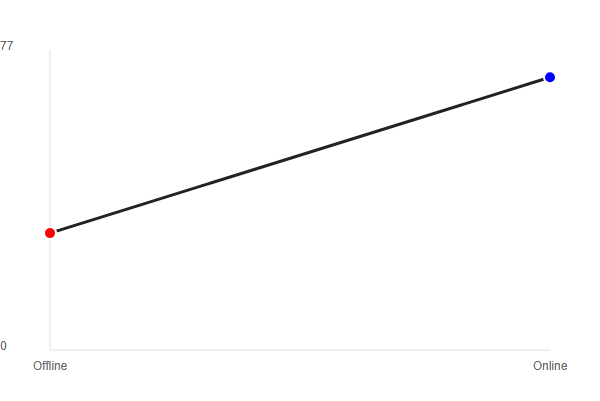
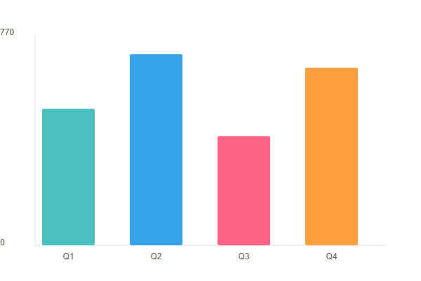
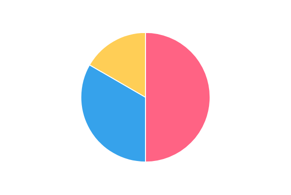

# Angular Custom Chart Component

A lightweight, dependency-free Angular component for rendering charts using pure SVG. Built as a reusable standalone component without relying on external charting libraries.

Developed as part of the Faclon Labs frontend technical assessment.

---

## Features

- **Pure SVG Rendering**: No external chart libraries (D3.js, Chart.js, etc.)
- **Multiple Chart Types**: Line, Column (vertical bars), and Pie charts
- **Standalone Component**: Easy integration into any Angular application
- **Responsive Design**: SVG viewBox-based scaling adapts to container dimensions
- **Interactive Elements**: Hover effects and tooltips for enhanced data visualization
- **Accessibility**: Includes SVG title/desc elements and keyboard focus support
- **Type Safety**: Strict TypeScript interfaces for chart configuration

---

## Requirements

- Node.js 16.x or higher
- Angular 15.x or higher
- npm or yarn package manager

---

## Installation

### 1. Clone and Install Dependencies

```bash
npm install
```

### 2. Start Development Server

```bash
npm start
```

The application will be available at `http://localhost:4200`

---

## Usage

### Import the Component

Include the chart component in your standalone component or module:

```typescript
import { ChartComponent } from './chart/chart.component';

@Component({
  standalone: true,
  imports: [ChartComponent],
  // ...
})
export class AppComponent {}
```

### Add to Template

Use the component with a configuration object:

```html
<io-chart [chartOptions]="chartOptions"></io-chart>
```

### Configuration Examples

**Line Chart** - Ideal for trends over time:

```typescript
const lineOptions: ChartOptions = {
  type: 'line',
  title: 'Monthly Sales',
  series: [
    { name: 'Jan', value: 100, color: '#FF5733' },
    { name: 'Feb', value: 150, color: '#33FF57' },
    { name: 'Mar', value: 200, color: '#3357FF' },
  ],
};
```

**Column Chart** - Best for category comparisons:

```typescript
const columnOptions: ChartOptions = {
  type: 'column',
  title: 'Revenue by Quarter',
  series: [
    { name: 'Q1', value: 500, color: '#3357FF' },
    { name: 'Q2', value: 750, color: '#FF33A1' },
    { name: 'Q3', value: 600, color: '#FFC300' },
    { name: 'Q4', value: 900, color: '#33FF57' },
  ],
};
```

**Pie Chart** - Displays proportional distribution:

```typescript
const pieOptions: ChartOptions = {
  type: 'pie',
  title: 'Market Share',
  series: [
    { name: 'Product A', value: 40, color: '#FFC300' },
    { name: 'Product B', value: 60, color: '#DBFF33' },
  ],
};
```

---

## API Reference

### ChartOptions Interface

```typescript
interface ChartOptions {
  type: 'line' | 'column' | 'pie'; // Chart type
  title: string; // Chart title
  series: ChartSeries[]; // Data points
}
```

### ChartSeries Interface

```typescript
interface ChartSeries {
  name: string; // Label for the data point
  value: number; // Numeric value
  color: string; // Color (hex, rgb, or named)
}
```

**Field Specifications**:

- `type`: Determines chart rendering mode
- `title`: Displayed at the top of the chart
- `series`: Array of data points (minimum 1 required)
- `name`: Data point label (used in legends and tooltips)
- `value`: Must be a positive number
- `color`: Any valid CSS color value

---

## Project Structure

```
src/
├── app/
│   ├── chart/
│   │   ├── chart.ts              # Component logic and data processing
│   │   ├── chart.html            # SVG template and bindings
│   │   ├── chart.scss            # Styles and animations
│   │   ├── chart.spec.ts         # Unit tests
│   │   └── chart.interface.ts    # TypeScript interfaces
│   ├── app.ts                    # Root component
│   ├── app.html                  # App template
│   ├── app.routes.ts             # Route configuration
│   └── app.spec.ts               # App tests
├── index.html                    # Index file
├── main.ts                       # App bootstrap
└── styles.scss                   # Global styles
screenshots/
├── chart-1.png                   # Line chart screenshot
├── chart-2.png                   # Column chart screenshot
└── chart-3.png                   # Pie chart screenshot
```

---

## Technical Implementation

### Chart Rendering Logic

**Column Chart**:

- Calculates bar height relative to maximum series value
- Scales bars proportionally within SVG viewport
- Applies hover effects with CSS transitions

**Line Chart**:

- Maps data points to X/Y coordinates within SVG grid
- Generates polyline path connecting all points
- Uses CSS keyframe animations for drawing effect

**Pie Chart**:

- Converts data values to radians for arc calculations
- Uses SVG Arc command (A) to draw each slice
- Calculates cumulative angles for proper slice positioning

### Responsive Scaling

Charts use SVG `viewBox` attribute for resolution-independent scaling:

```svg
<svg viewBox="0 0 400 300" preserveAspectRatio="xMidYMid meet">
  <!-- Chart elements -->
</svg>
```

This ensures charts adapt to any container size without quality loss.

### Styling Strategy

- **Component-scoped SCSS**: Styles encapsulated using Angular's ViewEncapsulation
- **CSS animations**: Smooth transitions for hover states and initial rendering
- **Accessibility**: Focus indicators for keyboard navigation

---

## Development

### Running Tests

Execute unit tests with:

```bash
npm test
```

### Code Quality

```bash
# Linting
npm run lint

# Format code
npm run format
```

---

## Screenshots

The project includes screenshots of all three supported chart types:

### Line Chart



### Column Chart



### Pie Chart



---

## Design Decisions

### Why No External Libraries?

This project intentionally avoids Chart.js, D3.js, and similar libraries to:

- Minimize bundle size (component is <5KB)
- Demonstrate pure Angular and SVG capabilities
- Maintain full control over rendering logic
- Reduce dependency vulnerabilities

### Performance Considerations

- **Change Detection**: Uses OnPush strategy for efficient rendering
- **SVG Optimization**: Minimal DOM manipulation through Angular directives
- **Animation Performance**: CSS transforms for hardware acceleration

---

## Known Limitations

- No support for multi-series line/column charts
- Limited customization options for axes and gridlines
- No data interpolation for missing values
- Pie chart does not handle negative values
